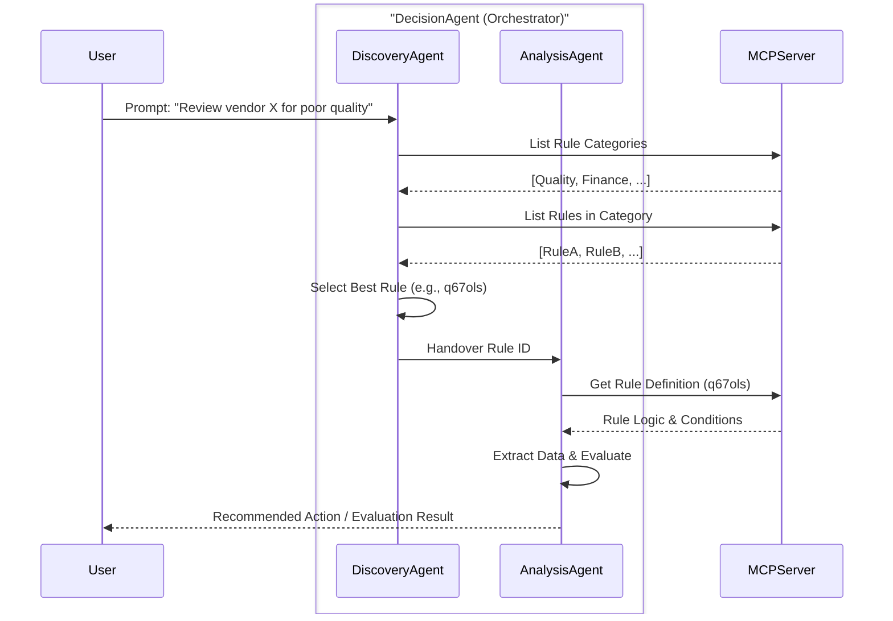

# Rules Decision Agent (Python ADK)

This agent uses the Google Gen AI Agent Development Kit (ADK) and the Agent-to-Agent (A2A) protocol to evaluate business rules based on user input. It connects to a local Menu Context Protocol (MCP) server to retrieve rule definitions.

## Prerequisites

*   **Python 3.10+**
*   **Google Gen AI API Key** (Gemini)
*   **Rules MCP Server** running locally at `http://localhost:8080/mcp`.
    *   The MCP server is located in the `rule-mngt-app` repository: [https://github.com/ameya-sap/rule-mngt-app](https://github.com/ameya-sap/rule-mngt-app)
    *   Ensure it is started and listening before running this agent.

## Setup & Installation

1.  **Create a Virtual Environment:**
    ```bash
    python3 -m venv .venv
    source .venv/bin/activate
    ```

2.  **Install Dependencies:**
    ```bash
    pip install -r requirements.txt
    ```

3.  **Environment Configuration:**
    Create a `.env` file in this directory and add your API keys:
    ```bash
    # Google Gemini API Key (for decision agent and resume analysis)
    GOOGLE_API_KEY=AIzaSy...
    
    # DeepSeek API Key (alternative for resume analysis, recommended)
    DEEPSEEK_API_KEY=sk-...
    ```
    
    **Note**: DeepSeek is recommended for resume analysis as it has more generous quotas and avoids the 429 errors common with Gemini's free tier.

## Architecture

The agent operates in two phases:
1.  **Discovery Phase**: Identifies the most relevant business rule category and specific rule ID based on the user's prompt.
2.  **Analysis Phase**: Evaluates the selected rule's conditions against extracted data from the prompt and typically recommends an action.



## Testing Options

### Option 1: Direct CLI Execution
Run the agent directly from the command line for quick testing.

```bash
# Activate venv if not already active
source .venv/bin/activate

# usage: python run_direct.py "<Your Prompt>"
python run_direct.py "Vendor 1001 has failed 5 quality inspections this quarter."
```

### Option 2: A2A Server Mode
Run the agent as a server compliant with the A2A protocol and test interactions.

1.  **Start the A2A Server:**
    ```bash
    python run_a2a.py
    ```
    *Server runs on http://localhost:8001*

2.  **Run the Test Client (in a separate terminal):**
    ```bash
    python test_a2a.py "Vendor 1001 has failed 5 quality inspections this quarter."
    ```

## Example Prompts

Try these prompts to test different rules defined in `rules-data/db.json`:

| Scenario | Rule Name | Prompt |
| :--- | :--- | :--- |
| **Quality Control** | Vendor Blacklisting | *"Vendor V-999 has failed 4 quality inspections in the Current Quarter. Please review."* |
| **Sales Discount** | Product Launch | *"Apply discount for order ORD-555 containing 'New Gadgets' sold in Q4."* |
| **IT Ops** | Long Queries | *"Query QID-777 has been running for 400 seconds. User is admin."* |
| **Compliance** | Hazardous Goods | *"Shipment SH-900 contains Ultra-Pure dangerous goods going to Germany (DE)."* |
| **Finance** | Invoice Blocking | *"Invoice INV-2020 price is 150. Purchase Order price was 100. Block payment."* |

## Resume Q&A Extraction Feature

In addition to business rules evaluation, this agent can extract interview questions and answers from uploaded resumes.

### Usage

#### CLI Mode - DeepSeek (Recommended)
```bash
# Process a resume file using DeepSeek (no quota issues)
python run_deepseek_resume.py examples/sample_resume.txt
python run_deepseek_resume.py /path/to/resume.pdf
python run_deepseek_resume.py /path/to/resume.docx
```

#### CLI Mode - Google Gemini
```bash
# Process a resume file using Google Gemini
python run_resume.py examples/sample_resume.txt
python run_resume.py /path/to/resume.pdf
python run_resume.py /path/to/resume.docx
```

**Note**: DeepSeek is recommended for resume analysis due to better quota limits. See [DEEPSEEK_GUIDE.md](DEEPSEEK_GUIDE.md) for detailed comparison.

#### A2A API Mode
```bash
# Start the A2A server
python run_a2a.py

# In another terminal, upload a resume
curl -X POST http://localhost:8001/resume/extract \
  -F "file=@examples/sample_resume.txt"

# Get supported formats
curl http://localhost:8001/resume/formats
```

### Supported File Formats
- **PDF** (.pdf) - Portable Document Format
- **DOCX** (.docx) - Microsoft Word documents  
- **TXT** (.txt) - Plain text files

### Output Format

The resume processor returns a JSON object with:
- **candidateInfo**: Name, email, phone, location
- **summary**: Professional summary
- **extractedData**: Skills, experience, education, projects
- **questionsAndAnswers**: Categorized interview questions with suggested answers
  - Technical Skills
  - Behavioral (STAR format)
  - Project Deep-Dive
  - Problem-Solving

### Example Output
```json
{
  "success": true,
  "candidateInfo": {
    "name": "John Doe",
    "email": "john@example.com"
  },
  "questionsAndAnswers": [
    {
      "category": "Technical Skills",
      "questions": [
        {
          "question": "Can you explain your experience with Python?",
          "suggestedAnswer": "Based on your resume...",
          "difficulty": "intermediate",
          "relatedSkills": ["Python", "Django"]
        }
      ]
    }
  ]
}
```
