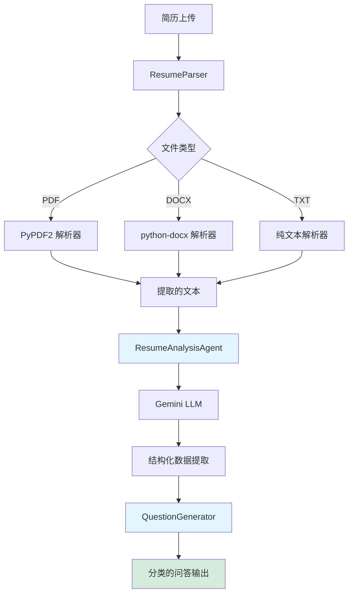

# 简历问答提取功能实施计划

## 概述

本计划为决策代理添加了一个新功能，可以从上传的简历中提取问题和答案。系统将解析简历文档（PDF、DOCX、TXT），使用 Gemini 分析内容，并根据候选人的经验生成相关的面试问题和建议答案。

## 需要用户审查

> [!IMPORTANT]
> **文件格式支持**：初始实现将支持 PDF、DOCX 和 TXT 格式。您是否需要支持其他格式（例如 RTF、ODT）？

> [!IMPORTANT]
> **问答生成策略**：系统将在以下类别中生成问题：
> - 基于列出的技术的技术技能问题
> - 基于经验的行为问题
> - 项目特定的深入问题
> - 一般能力问题
> 
> 请确认此分类是否满足您的需求，或者您是否希望使用不同的类别。

> [!IMPORTANT]
> **集成方法**：此功能将作为新代理添加到现有的发现和分析代理旁边。可以通过以下方式访问：
> 1. 新的 CLI 命令：`python run_resume.py <resume_file>`
> 2. 新的 A2A 端点：`/resume/extract`
> 
> 这应该集成到现有工作流中还是保持独立？

## 建议的更改

### 核心组件

#### [新建] [resume_agent.py](file:///Users/elonxu/Desktop/decision-agent-demo/rules_decision_agent/src/resume_agent.py)

处理简历处理和问答提取的新代理模块：
- `ResumeParser` 类：从各种文件格式中提取文本
- `ResumeAnalysisAgent` 类：基于 LLM 的代理，分析简历内容
- `QuestionGenerator` 类：生成分类的问题和答案
- 与现有 ADK 框架集成

**主要功能：**
- 多格式文档解析（PDF、DOCX、TXT）
- 结构化信息提取（技能、经验、教育、项目）
- 上下文感知的问题生成
- 基于简历内容的答案建议

---

### CLI 和 API 集成

#### [新建] [run_resume.py](file:///Users/elonxu/Desktop/decision-agent-demo/rules_decision_agent/run_resume.py)

简历处理的直接 CLI 界面：
- 接受简历文件路径作为参数
- 以 JSON 格式输出结构化问答
- 提供格式化的控制台输出
- 不支持格式的错误处理

#### [修改] [run_a2a.py](file:///Users/elonxu/Desktop/decision-agent-demo/rules_decision_agent/run_a2a.py)

为简历处理添加新的 A2A 端点：
- `POST /resume/extract`：上传简历并获取问答
- `GET /resume/formats`：列出支持的文件格式
- 多部分文件上传处理
- 响应流支持

---

### 依赖和配置

#### [修改] [requirements.txt](file:///Users/elonxu/Desktop/decision-agent-demo/rules_decision_agent/requirements.txt)

添加文档处理库：
```
PyPDF2>=3.0.0          # PDF 解析
python-docx>=1.1.0     # DOCX 解析
python-multipart>=0.0.6 # 文件上传处理
```

#### [修改] [README.md](file:///Users/elonxu/Desktop/decision-agent-demo/rules_decision_agent/README.md)

为新的简历功能添加文档：
- 使用示例
- 支持的文件格式
- API 端点文档
- 示例输出格式

---

### 测试和示例

#### [新建] [test_resume.py](file:///Users/elonxu/Desktop/decision-agent-demo/rules_decision_agent/test_resume.py)

简历处理的测试套件：
- 文档解析的单元测试
- 问答生成的集成测试
- 示例简历固件
- 输出验证

#### [新建] [examples/sample_resume.txt](file:///Users/elonxu/Desktop/decision-agent-demo/rules_decision_agent/examples/sample_resume.txt)

用于测试和演示的示例简历。

## 架构



## 数据流

1. **输入**：用户上传简历文件（PDF/DOCX/TXT）
2. **解析**：`ResumeParser` 从文档中提取原始文本
3. **分析**：`ResumeAnalysisAgent` 使用 Gemini 提取结构化信息：
   - 个人信息
   - 技能和技术
   - 工作经验
   - 教育背景
   - 项目和成就
4. **生成**：`QuestionGenerator` 创建问题和答案：
   - 将技能映射到技术问题
   - 从经验生成行为问题
   - 创建项目特定的问题
   - 基于简历内容建议答案
5. **输出**：返回带有分类问答的结构化 JSON

## 输出格式

```json
{
  "candidateInfo": {
    "name": "张三",
    "email": "zhangsan@example.com",
    "summary": "拥有 5 年经验的高级软件工程师..."
  },
  "extractedData": {
    "skills": ["Python", "JavaScript", "React", "AWS"],
    "experience": [...],
    "education": [...],
    "projects": [...]
  },
  "questionsAndAnswers": [
    {
      "category": "技术技能",
      "questions": [
        {
          "question": "您能解释一下使用 Python 的经验吗？",
          "suggestedAnswer": "根据您的简历，您有...",
          "difficulty": "中级",
          "relatedSkills": ["Python", "Django"]
        }
      ]
    },
    {
      "category": "行为问题",
      "questions": [...]
    }
  ]
}
```

## 验证计划

### 自动化测试

1. **单元测试** (`test_resume.py`)：
   ```bash
   pytest test_resume.py -v
   ```
   - 使用示例文件测试 PDF 解析
   - 使用示例文件测试 DOCX 解析
   - 测试文本提取准确性
   - 测试问答生成逻辑

2. **集成测试**：
   ```bash
   python run_resume.py examples/sample_resume.txt
   ```
   - 验证端到端处理
   - 验证输出格式
   - 检查问题质量和相关性

### 手动验证

1. **文件格式测试**：
   - 使用真实的 PDF 简历测试
   - 使用 DOCX 简历测试
   - 使用纯文本简历测试
   - 验证每种格式的解析准确性

2. **问答质量评估**：
   - 审查生成的问题的相关性
   - 验证答案与简历内容一致
   - 检查问题分类的准确性
   - 确保没有虚构的信息

3. **API 测试**（如果批准 A2A 集成）：
   ```bash
   # 启动服务器
   python run_a2a.py
   
   # 测试上传端点
   curl -X POST http://localhost:8001/resume/extract \
     -F "file=@examples/sample_resume.pdf"
   ```

4. **错误处理**：
   - 使用损坏的文件测试
   - 使用不支持的格式测试
   - 使用空文件测试
   - 验证适当的错误消息
