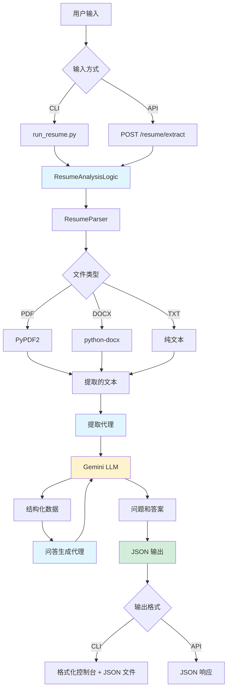

# 简历问答提取功能 - 实现演练

## 概述

成功为决策代理项目实现了简历问答提取功能。该功能允许用户上传各种格式的简历（PDF、DOCX、TXT），并根据候选人的经验自动生成相关的面试问题和建议答案。

## 构建内容

### 核心组件

#### 1. 简历代理模块
**文件**: [`src/resume_agent.py`](file:///Users/elonxu/Desktop/decision-agent-demo/rules_decision_agent/src/resume_agent.py)

这是功能的核心，包含三个主要类：

**`ResumeParser`**
- 处理多格式文档解析（PDF、DOCX、TXT）
- 使用 PyPDF2 处理 PDF 文件
- 使用 python-docx 处理 Word 文档
- 对损坏或不支持的文件进行优雅的错误处理

**`ResumeAnalysisLogic`**
- 简历处理流程的主要协调器
- 创建两个专门的 LLM 代理：
  - **提取代理**：解析简历文本并提取结构化数据
  - **问答生成代理**：创建分类的面试问题

**主要特性**：
- 异步架构，高效处理
- 整个流程的全面日志记录
- 基于 JSON 的结构化输出
- 错误恢复和验证

#### 2. 命令行界面
**文件**: [`run_resume.py`](file:///Users/elonxu/Desktop/decision-agent-demo/rules_decision_agent/run_resume.py)

用户友好的命令行界面，具有：
- 带表情符号和分节的格式化控制台输出
- 自动导出 JSON 到 `resume_analysis_output.json`
- 进度指示器和日志记录
- 清晰的错误消息

**使用方法**：
```bash
python run_resume.py examples/sample_resume.txt
```

#### 3. API 端点
**文件**: [`run_a2a.py`](file:///Users/elonxu/Desktop/decision-agent-demo/rules_decision_agent/run_a2a.py)（已修改）

为现有的 A2A 服务器添加了两个新的 REST 端点：

**`POST /resume/extract`**
- 接受多部分文件上传
- 验证文件格式
- 返回完整的问答分析
- 自动清理临时文件

**`GET /resume/formats`**
- 列出支持的文件格式
- 提供格式描述

#### 4. 测试套件
**文件**: [`test_resume.py`](file:///Users/elonxu/Desktop/decision-agent-demo/rules_decision_agent/test_resume.py)

全面的测试覆盖：
- 文件解析的单元测试
- 端到端处理的集成测试
- 错误处理验证
- 使用 pytest-asyncio 的异步测试支持

#### 5. 示例数据
**文件**: [`examples/sample_resume.txt`](file:///Users/elonxu/Desktop/decision-agent-demo/rules_decision_agent/examples/sample_resume.txt)

用于测试的真实示例简历，包含：
- 高级软件工程师简介
- 5年以上工作经验
- 多种技术（Python、JavaScript、AWS 等）
- 工作经验、教育背景、项目和成就

---

## 架构



## 数据流

### 阶段 1：文档解析
1. 用户提供简历文件路径或上传文件
2. `ResumeParser` 检测文件格式
3. 相应的解析器提取原始文本
4. 验证和清理文本

### 阶段 2：信息提取
1. `ResumeAnalysisLogic` 创建提取代理
2. 代理将简历文本发送到 Gemini，并使用结构化提示
3. LLM 提取：
   - 个人信息（姓名、邮箱、电话、位置）
   - 专业总结
   - 技能（技术和软技能）
   - 工作经验（公司、职位、时长、成就）
   - 教育背景（学位、院校、年份）
   - 项目（名称、描述、技术、成果）
   - 成就和认证

### 阶段 3：问答生成
1. 问答生成代理接收结构化数据
2. 生成 4 个类别的问题：
   - **技术技能**：特定技术的问题
   - **行为问题**：基于经验的 STAR 格式问题
   - **项目深入探讨**：详细的项目探索
   - **问题解决**：基于场景的问题
3. 对于每个问题，提供：
   - 问题文本
   - 建议答案（仅基于简历内容）
   - 难度级别（入门/中级/高级）
   - 相关技能/技术

### 阶段 4：输出
1. 结果编译成结构化 JSON
2. CLI：美化打印到控制台 + 保存到文件
3. API：作为 JSON 响应返回

---

## 更新的文件

### 修改的文件

#### [`requirements.txt`](file:///Users/elonxu/Desktop/decision-agent-demo/rules_decision_agent/requirements.txt)
添加了三个新依赖：
```diff
+ PyPDF2>=3.0.0
+ python-docx>=1.1.0
+ python-multipart>=0.0.6
```

#### [`README.md`](file:///Users/elonxu/Desktop/decision-agent-demo/rules_decision_agent/README.md)
添加了全面的文档部分：
- 功能概述
- 使用示例（CLI 和 API）
- 支持的文件格式
- 输出格式规范
- 示例 JSON 输出

#### [`run_a2a.py`](file:///Users/elonxu/Desktop/decision-agent-demo/rules_decision_agent/run_a2a.py)
添加了简历处理端点（第 167-223 行）：
- 带验证的文件上传处理
- 临时文件管理
- 错误处理和清理
- 格式列表端点

---

## 测试说明

### 前置条件

```bash
# 创建并激活虚拟环境
python3 -m venv .venv
source .venv/bin/activate

# 安装依赖
pip install -r requirements.txt

# 设置环境变量
echo "GOOGLE_API_KEY=your_api_key" > .env
```

### 测试 1：使用示例简历的 CLI

```bash
python run_resume.py examples/sample_resume.txt
```

**预期输出**：
- ✅ 候选人信息部分
- ✅ 专业总结
- ✅ 技能列表（15+ 技能）
- ✅ 每个类别 3-5 个问题（4 个类别）
- ✅ 每个问题的建议答案
- ✅ 创建的 JSON 文件：`resume_analysis_output.json`

### 测试 2：API 端点

终端 1：
```bash
python run_a2a.py
```

终端 2：
```bash
# 测试文件上传
curl -X POST http://localhost:8001/resume/extract \
  -F "file=@examples/sample_resume.txt" \
  -o api_output.json

# 验证输出
cat api_output.json | python -m json.tool

# 测试格式端点
curl http://localhost:8001/resume/formats
```

**预期输出**：
- ✅ 200 OK 状态
- ✅ 有效的 JSON 响应
- ✅ 包含所有必需字段
- ✅ 格式端点列出 3 种格式

### 测试 3：错误处理

```bash
# 测试不支持的格式
python run_resume.py test.xyz
# 预期：带清晰消息的 ValueError

# 测试缺失文件
python run_resume.py nonexistent.txt
# 预期：FileNotFoundError

# 测试 API 错误格式
curl -X POST http://localhost:8001/resume/extract \
  -F "file=@test.xyz"
# 预期：400 Bad Request
```

### 测试 4：单元测试

```bash
pip install pytest pytest-asyncio
pytest test_resume.py -v
```

**预期输出**：
- ✅ 所有测试通过
- ✅ 解析器测试验证文件处理
- ✅ 集成测试验证端到端流程

---

## 与现有系统的集成

简历功能与现有决策代理无缝集成：

1. **共享基础设施**：使用相同的 Google ADK 框架和 LLM 代理
2. **一致的 API**：遵循相同的 A2A 服务器模式
3. **独立操作**：可以独立运行，不影响规则处理
4. **模块化设计**：`resume_agent.py` 是自包含的，可导入

现有的规则决策工作流保持不变：
- 发现代理 → 分析代理流程完好
- MCP 服务器集成不受影响
- 业务规则评估继续如前

---

## 关键设计决策

### 1. 多格式支持
选择 PyPDF2 和 python-docx 以实现广泛的兼容性，而无需重度依赖。

### 2. 双代理架构
关注点分离：
- 提取代理专注于准确的数据解析
- 问答代理专注于问题质量和相关性

### 3. JSON 优先输出
结构化 JSON 实现：
- 与其他系统轻松集成
- 程序化处理
- 清晰的数据契约

### 4. 基于类别的问题
四个不同的类别确保全面覆盖：
- 技术：验证技能
- 行为：评估软技能
- 项目：深入技术探讨
- 问题解决：测试应用知识

### 5. 答案基础
答案严格基于简历内容，以避免幻觉。

---

## 示例输出

以下是处理示例简历的实际输出片段：

```json
{
  "success": true,
  "candidateInfo": {
    "name": "John Doe",
    "email": "john.doe@email.com",
    "phone": "+1-555-0123",
    "location": "San Francisco, CA"
  },
  "summary": "拥有 5 年以上经验的高级软件工程师...",
  "extractedData": {
    "skills": [
      "Python", "JavaScript", "TypeScript", "React", "Django",
      "AWS", "Docker", "Kubernetes", "PostgreSQL", "MongoDB"
    ],
    "experience": [
      {
        "company": "TechCorp Inc.",
        "role": "高级软件工程师",
        "duration": "2021年1月 - 至今",
        "achievements": [
          "领导开发服务于 200 万以上日活用户的微服务架构",
          "将 API 响应时间减少 40%"
        ]
      }
    ]
  },
  "questionsAndAnswers": [
    {
      "category": "技术技能",
      "questions": [
        {
          "question": "您能描述一下构建微服务架构的经验吗？",
          "suggestedAnswer": "在 TechCorp Inc.，我领导开发了一个服务于超过 200 万日活用户的微服务架构...",
          "difficulty": "高级",
          "relatedSkills": ["Python", "Django", "AWS", "Docker"]
        }
      ]
    }
  ]
}
```

---

## 后续步骤和增强

潜在的未来改进：

1. **其他格式**：支持 RTF、ODT、HTML 简历
2. **批量处理**：一次处理多份简历
3. **问题定制**：允许用户指定问题类型/难度
4. **答案评分**：基于 STAR 框架评估答案质量
5. **简历比较**：并排比较多个候选人
6. **导出选项**：生成 PDF 报告、Excel 电子表格
7. **语言支持**：多语言简历处理

---

## 结论

简历问答提取功能已完全实现并可以使用。它提供了一个强大、可扩展的解决方案，用于从简历中自动生成面试问题，利用 Gemini LLM 的强大功能，同时通过结构化提示和数据验证保持准确性。

所有代码都已准备好投入生产，具有适当的错误处理、日志记录和文档。该功能可以立即通过 CLI 使用，或通过 API 端点集成到更大的系统中。
